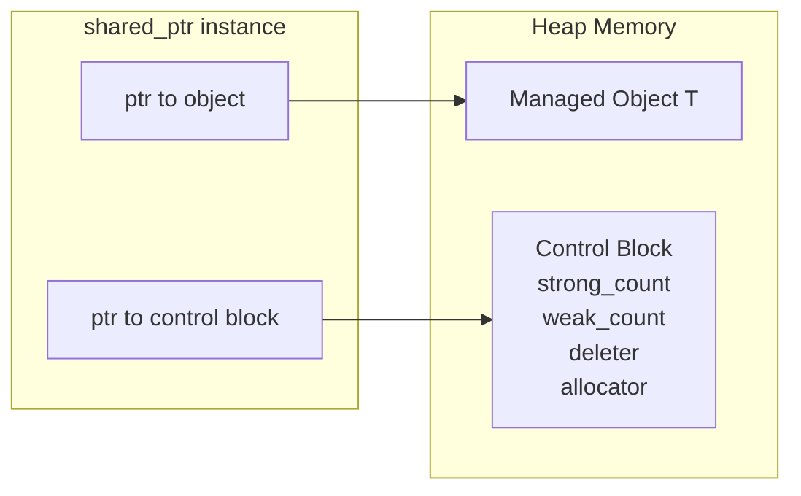

# A Deep Dive into shared_ptr: Shared Ownership and Reference Counting

In the previous article, we discussed `unique_ptr`—the zero-overhead smart pointer for exclusive ownership. But in the real world, resources aren't always exclusively owned by a single master. Sometimes, an object genuinely needs to be held and managed jointly by multiple modules—such as a configuration object read by multiple subsystems, a network connection shared across tasks, or a cache entry accessed by multiple consumers. In these cases, the "exclusive" semantics of `unique_ptr` fall short.

`shared_ptr` is designed precisely for this scenario. Its core idea is **reference counting**: for every additional `shared_ptr` pointing to the object, the count increments by one; for every `shared_ptr` destroyed, it decrements by one; when the count reaches zero, the object is automatically destroyed. It sounds simple and elegant, but the underlying implementation details—control blocks, atomic operations, and memory allocation strategies—are far more complex than one might imagine.

## Shared Ownership: Semantics and Costs

`shared_ptr` expresses "shared ownership" semantics: multiple `shared_ptr` instances can point to the same object, and they jointly determine its lifetime. The object is deleted only when the very last `shared_ptr` is destroyed.

```cpp
#include <iostream>
#include <memory>

struct Foo {
    Foo() { std::cout << "Foo created\n"; }
    ~Foo() { std::cout << "Foo destroyed\n"; }
    void greet() const { std::cout << "Hello from Foo\n"; }
};

int main() {
    auto p1 = std::make_shared<Foo>();  // 强引用计数 = 1
    {
        auto p2 = p1;                    // 强引用计数 = 2
        p2->greet();
    }                                    // p2 离开作用域，强引用计数 = 1
    p1->greet();
}                                        // p1 离开作用域，强引用计数 = 0，Foo 被销毁
```

Output:

```text
Foo created
Hello from Foo
Hello from Foo
Foo destroyed
```

This looks wonderful. But shared ownership isn't free—every copy and destruction of a `shared_ptr` requires updating the reference count, and this count must be thread-safe (via atomic operations). Furthermore, `shared_ptr` internally maintains a control block to store the reference count and other metadata. These overheads become very noticeable in scenarios where `shared_ptr` instances are frequently created and destroyed.

Our advice is to use `unique_ptr` whenever possible, and only resort to `shared_ptr` when shared ownership is genuinely required. `shared_ptr` should not become an excuse for being "too lazy to think about ownership."

## The Control Block: The Internal Structure of shared_ptr

To understand the performance characteristics of `shared_ptr`, we must first understand its internal structure. A `shared_ptr` actually contains two pointers: one to the managed object, and another to the control block.

The control block is a heap-allocated data structure containing the strong reference count (the number of `shared_ptr` instances), the weak reference count (the number of `weak_ptr` instances), a custom deleter (if any), and a custom allocator (if any). When you create a `shared_ptr` using `make_shared`, the object and the control block are placed in the same memory block (a single allocation); when created using `shared_ptr(new T(...))`, the object and the control block are two separate allocations.

Let's use a simplified diagram to understand this:



Therefore, a `shared_ptr` object itself is `sizeof(T*) * 2`—two pointers. On a 64-bit system, it is 16 bytes, exactly twice the size of a `unique_ptr` (8 bytes). The size of the control block itself depends on the implementation (GNU libstdc++ on x86_64 is approximately 32 bytes).

## The Advantage of make_shared: Single Allocation

As mentioned earlier, `make_shared` places the object and the control block in a contiguous memory block. This brings three significant benefits.

The first is **fewer heap allocations**—reduced from two to one. In performance-sensitive code, heap allocation is an expensive operation (usually involving locks, traversing free lists, etc.), so reducing the number of allocations is always beneficial. You can verify through `std::allocator_traits` that `make_shared` indeed performs only one allocation.

The second is **better cache locality**. Because the object and the control block are in the same memory block, a CPU cache line might hit both simultaneously. With two separate allocations, the memory blocks could be physically far apart, leading to more cache misses.

The third is **less memory fragmentation**. One allocation means one deallocation, rather than two separate deallocations at different locations.

```cpp
#include <iostream>
#include <memory>

struct Widget {
    int data[100]; // 较大的对象
};

void test_make_shared() {
    // 对象和控制块在同一个内存块中（一次分配）
    auto p = std::make_shared<Widget>();
    std::cout << "make_shared: object at " << p.get() << "\n";
    std::cout << "make_shared: control block nearby\n";
}

void test_new_shared() {
    // 对象和控制块是两次独立分配
    std::shared_ptr<Widget> p(new Widget());
    std::cout << "new: object at " << p.get() << "\n";
    std::cout << "new: control block at a different location\n";
}
```

⚠️ `make_shared` also has a lesser-known drawback: because the object and the control block share the same memory block, when all `shared_ptr` instances are destroyed (strong reference count reaches zero), the object is destructed, but the memory for the control block is not immediately released—the entire memory block is only reclaimed when all `weak_ptr` instances are also destroyed (weak reference count reaches zero). If the object is large and `weak_ptr` instances are still in use, it can cause memory usage to be higher than expected. If you expect `weak_ptr` instances to exist long-term, consider using `std::shared_ptr<T>(new T(...))` to separate the object's memory from the control block, so that the object's memory can be freed immediately when the strong reference count reaches zero.

## Atomic Operations on Reference Counts and Thread Safety

`shared_ptr` uses atomic operations for its reference counts to ensure thread safety. This means that in a multithreaded environment, you can safely copy and destroy the `shared_ptr` instances themselves (the incrementing and decrementing of the reference count are atomic), but **access to the managed object is not protected**—if multiple threads read and write to the object itself simultaneously, you still need to lock it yourself.

This is a common misconception: many people think `shared_ptr` provides "thread safety for the object," but it actually only guarantees "thread safety for the reference count." We can use cppreference's description for a precise understanding: the control block of a `shared_ptr` is thread-safe—multiple threads can simultaneously operate on different `shared_ptr` instances (even if they point to the same object) without external synchronization. However, the same `shared_ptr` instance cannot be read and written simultaneously by multiple threads (locking is required). Concurrent access to the managed object must be made safe by you.

```cpp
#include <iostream>
#include <memory>
#include <thread>
#include <mutex>

struct Counter {
    int value = 0;
    std::mutex mtx;
    void increment() {
        std::lock_guard<std::mutex> lock(mtx);
        ++value;
    }
};

int main() {
    auto counter = std::make_shared<Counter>();

    // 安全：多个线程拷贝 shared_ptr（引用计数原子操作）
    std::thread t1([counter]() {  // 拷贝发生在这里
        counter->increment();     // 安全：对象访问有 mutex 保护
    });
    std::thread t2([counter]() {  // 拷贝发生在这里
        counter->increment();     // 安全：对象访问有 mutex 保护
    });

    t1.join();
    t2.join();
    std::cout << "Counter value: " << counter->value << "\n"; // 输出 2
}
```

From a performance perspective, every copy or destruction of a `shared_ptr` generates an atomic operation (typically `fetch_add` or `fetch_sub`). On a single-core system, the overhead of atomic operations is very small (it might just be a special CPU instruction), but on multi-core systems, it incurs the cost of cache coherence protocols (cache line bouncing). If your code frequently creates and destroys `shared_ptr` instances (for example, in a hot loop), this overhead can become very significant. You can verify the overhead difference between single-threaded and multi-threaded scenarios using Google Benchmark.

The logic when decrementing the reference count is particularly noteworthy. When `fetch_sub` returns 1 (meaning this is the last `shared_ptr`), the object needs to be destroyed. Mainstream implementations (like GNU libstdc++) use `memory_order_acq_rel` to ensure all previous write operations are visible to the destruction code, and insert a `memory_order_acquire` fence before destruction. These memory barriers have little overhead on x86 (x86 inherently has strong memory ordering), but on weakly-ordered architectures like ARM, they can cause pipeline flushes.

## Performance Overhead Analysis of shared_ptr

Let's do an intuitive comparison, putting the overhead of `shared_ptr`, `unique_ptr`, and raw pointers into one table:

| Dimension | Raw Pointer | unique_ptr | shared_ptr |
|-----------|-------------|------------|------------|
| Object size | 8B (64-bit) | 8B | 16B |
| Extra heap allocation | None | None | Control block (24-32B+) |
| Copy overhead | 8B copy | Not copyable | Atomic fetch_add |
| Destruction overhead | None | delete | Atomic fetch_sub + possible delete |
| Thread safety | None | None | Reference count safe, object unsafe |

From this table, we can clearly see that `shared_ptr` is heavier than `unique_ptr` in every dimension. This isn't to say `shared_ptr` is bad—it is the correct design choice in scenarios requiring shared ownership—but you should use it only when shared ownership is genuinely needed, rather than "using `shared_ptr` everywhere for convenience."

In real-world projects, we've seen quite a few codebases that manage almost all objects with `shared_ptr`, resulting in reference counts flying everywhere, performance that cannot be optimized, and frequent circular reference issues. A better approach is to clarify ownership relationships during the design phase: manage most resources with `unique_ptr`, use `shared_ptr` only in the few places where sharing is truly necessary, and pass non-owning access via references (`T&`) or raw pointers (`T*`, which do not hold ownership).

## Aliasing Constructor: A Powerful, Lesser-Known Feature

`shared_ptr` has a very powerful but lesser-known constructor called the **aliasing constructor**. Its signature is:

```cpp
template<class Y>
shared_ptr(const shared_ptr& r, Y* ptr) noexcept;
```

This constructor creates a new `shared_ptr` that shares the ownership of `r` (i.e., its reference count is shared with `r`), but `get()` returns `ptr` instead of `r.get()`. Simply put: **it lets you hold a "part" of the same object without needing to manage that part's lifetime separately**.

The most common use case is accessing a member of an object:

```cpp
#include <iostream>
#include <memory>

struct Person {
    std::string name;
    int age;
};

int main() {
    auto person = std::make_shared<Person>();
    person->name = "Alice";
    person->age = 30;

    // 创建一个 shared_ptr，共享 person 的所有权，但指向 age 成员
    std::shared_ptr<int> age_ptr(person, &person->age);

    std::cout << "Age: " << *age_ptr << "\n";  // 输出 30
    std::cout << "Use count: " << person.use_count() << "\n";  // 输出 2

    person.reset();  // person 被释放，但 age_ptr 仍然有效
    std::cout << "Age still valid: " << *age_ptr << "\n";  // 输出 30
}
```

This feature is particularly useful when implementing "smart pointers to container elements"—for example, if you want to return a `shared_ptr` to a specific element in a `std::vector`, but you don't want the caller to hold a `shared_ptr` to the entire `std::vector`. Through the aliasing constructor, you can return a `shared_ptr` that only exposes the element type, while the underlying lifetime is still managed by the container's `shared_ptr`.

## enable_shared_from_this: Obtaining a shared_ptr in a Member Function

Sometimes, an object's member function needs to return a `shared_ptr` pointing to itself. The most intuitive approach, `std::shared_ptr<T>(this)`, is a fatal error—it creates a new control block, causing the object to be deleted twice. The correct approach is to inherit from `std::enable_shared_from_this<T>` and call `shared_from_this()`:

```cpp
#include <iostream>
#include <memory>

class NetworkConnection : public std::enable_shared_from_this<NetworkConnection> {
public:
    std::shared_ptr<NetworkConnection> get_shared() {
        // 正确：使用 enable_shared_from_this
        return shared_from_this();
    }

    // 错误示例（不要这样做！）：
    // std::shared_ptr<NetworkConnection> get_bad() {
    //     return std::shared_ptr<NetworkConnection>(this); // 双重释放！
    // }

    ~NetworkConnection() { std::cout << "Connection closed\n"; }
};

int main() {
    auto conn = std::make_shared<NetworkConnection>();
    auto conn2 = conn->get_shared();  // 安全：共享同一个控制块
    std::cout << "Use count: " << conn.use_count() << "\n";  // 输出 2
}
```

⚠️ Using `enable_shared_from_this` has a prerequisite: the object must already be managed by a `shared_ptr`. If you create the object on the stack or manage it with a raw pointer, calling `shared_from_this()` leads to undefined behavior. Furthermore, you cannot call `shared_from_this()` in the constructor—because at that point, the `shared_ptr` managing the object has not finished being constructed.

## Common Misuses and Pitfalls

Before diving into embedded trade-offs, let's take stock of a few common misuse patterns of `shared_ptr`. We've fallen into these "pitfalls" more than once ourselves, and we hope readers can avoid them in advance.

**Misuse 1: Creating a second control block with `shared_ptr(this)`**. This is the most fatal error. If you write `std::shared_ptr<T>(this)` in a member function of an object already managed by a `shared_ptr`, the compiler creates a brand-new control block with the reference count starting at 1. The result is two independent control blocks managing the same object—when both `shared_ptr` instances are destroyed, the object is deleted twice. The correct approach is to inherit from `enable_shared_from_this` and call `shared_from_this()`.

**Misuse 2: Exposing ownership intent in interfaces via `shared_ptr`**. If you write a function `void process(std::shared_ptr<Foo> foo)`, the signature itself implies "I want to share ownership with you." But often, the function just wants to use the object and doesn't need to hold it. In this scenario, passing `Foo&` or `Foo*` is more appropriate—it doesn't imply ownership, and it avoids the overhead of reference counting.

**Misuse 3: Using `shared_ptr` to manage objects that "don't need sharing"**. Some teams use `shared_ptr` to manage all heap objects just to save effort—"after all, `shared_ptr` can manage anything." This leads to blurred ownership semantics (everyone holds it means no one is responsible), degraded performance (atomic operations everywhere), and an increased risk of circular references. Our experience is: **90% of objects should be managed by `unique_ptr`, and only the 10% that genuinely need sharing should use `shared_ptr`**.

**Misuse 4: Ignoring the difference between `make_shared` and `new`**. `make_shared` merges the object and the control block into a single allocation, but this also means the object's destruction and the control block's release don't happen at the same moment—when all `shared_ptr` instances are destroyed, the object is destructed, but if `weak_ptr` instances are still alive, the entire memory block (including the space occupied by the object) won't be released until all `weak_ptr` instances are also destroyed. For large objects, this can lead to a phenomenon where "no one is using it, but the memory isn't returned." If you expect long-lived `weak_ptr` instances, using `std::shared_ptr<T>(new T(...))` to allocate the object and the control block separately might be more appropriate.

## Systemic Consequences of shared_ptr Abuse

We've dedicated a separate section here simply because we ourselves were once abusers...

Earlier, we went through common misuse patterns of `shared_ptr` one by one, but the severity of the problem goes far beyond "making a mistake somewhere." When `shared_ptr` is systematically abused in a codebase, it brings **architectural-level chronic poison**—not the kind of acute error that fails to compile, but a progressive rot that makes the codebase gradually unmaintainable, unreasonably complex, and unoptimizable. We've seen more than one project fall into this quagmire because "all objects are managed by `shared_ptr`," and fixing it often requires large-scale refactoring.

### Collapse of the Ownership Model

In a healthy design, every object should have a clear owner—"who created it, who destroys it, and whose decision determines its lifetime"—these questions should be answered clearly during the design phase. But when you use `shared_ptr` everywhere, the answer to these questions becomes "who knows, it'll naturally be destroyed when the reference count reaches zero." It sounds convenient, but the price is that you lose control over the object's lifetime: you cannot guarantee the object is alive at any specific moment (because other holders might release it at any time), nor can you guarantee the object is destroyed at any specific moment (because there might be holders you don't know about still referencing it). This state of "nobody is responsible" is remarkably similar to the problems caused by an overabundance of global variables.

In his C++Now talk, Sean Parent aptly compared abusing `shared_ptr` to **implicit global variables**—any code holding a `shared_ptr` participates in the object's lifetime management, a characteristic strikingly similar to global variables being "accessible anywhere and capable of having their lifetime extended from anywhere." A more practical problem is that once your public interface returns a `shared_ptr`, all callers are forced to use `shared_ptr`, even if they just want to temporarily borrow the object. You deprive callers of the right to choose their ownership model—a better approach is to return `unique_ptr` (callers can freely `release()` it to a raw pointer) or a raw pointer/reference (for non-owning access).

### Cache Line Contention Under Multithreading

This problem doesn't appear at all in single-threaded code, but it becomes very glaring in multithreaded scenarios. The control block of a `shared_ptr` stores the strong reference count and the weak reference count. These two atomic counters are usually in the same control block and likely share the same cache line (typically 64 bytes). When multiple threads frequently copy and destroy `shared_ptr` instances pointing to the **same object**, every thread's atomic modification to the reference count causes that cache line to bounce back and forth between different cores—even if these threads are operating on their own independent `shared_ptr` instances, as long as they point to the same object, they compete for the cache line of the same control block.

Talking isn't enough; let's run a test. The following benchmark program (`Google Benchmark`) builds a thread-safe producer-consumer queue, passing messages via raw pointers and `shared_ptr` respectively. The test environment is the author's Windows WSL2 Arch Linux, AMD Ryzen 7 5800H (14 threads), GCC 15.2, compiled with `CMake` Release mode. The results are as follows:

| Approach | Messages | Average Time | Relative Overhead |
|----------|----------|--------------|-------------------|
| Raw pointer | 10,000 | ~30 ms | Baseline |
| `shared_ptr` | 10,000 | ~35 ms | **+15-20%** |

A 15-20% overhead might be even more significant in real-world applications, because our test used a mutex-protected queue, and the mutex overhead masks some of the `shared_ptr` overhead. In lock-free queues or higher-concurrency scenarios (like the 8 threads in the original test), the overhead of `shared_ptr` becomes even more pronounced. The source of this overhead is clear: every `shared_ptr` copy atomically increments the reference count, and every destruction atomically decrements it—in scenarios where multiple threads simultaneously operate on the same control block, these atomic operations trigger cache line contention. It can be ignored in low-concurrency, low-throughput scenarios, but must be treated with extreme caution on high-concurrency hot paths.

### Circular References: Silent Memory Leaks

When an object leaks due to circular references, you won't get any error messages—the reference count of the `shared_ptr` will never reach zero, and the object just quietly sits on the heap occupying memory. No crashes, no assertion failures, no logs telling you "hey, this object leaked." You might only notice the problem when memory usage continuously grows, and then you need tools like Valgrind or AddressSanitizer to locate the leak. What's worse is that circular references are often not simple loops between two objects, but complex dependency graphs involving multiple objects—A holds B, B holds C, and C holds A—tracking the reference chain in such cases is a very painful endeavor.

In contrast, the exclusive ownership model of `unique_ptr` makes circular references impossible at compile time (you cannot construct a valid exclusive ownership cycle), which is a huge advantage at the design level. If you find yourself needing to use `weak_ptr` extensively to break circular references, that in itself is a strong signal: there is a problem with your ownership model design, and you should re-examine the dependencies between objects rather than patching things up everywhere with `weak_ptr`.

### Ownership Inversion: A Ticking Time Bomb in Callbacks

This problem is particularly common in asynchronous programming, and the bugs it causes are extremely difficult to track down. Suppose object A holds a Timer, and the Timer's callback captures A's `shared_ptr`. When A is reset in the main thread, the Timer thread ironically becomes A's sole holder—A's lifetime gets "inverted" onto the Timer thread. If the Timer's destructor needs to join the thread it resides on (`std::jthread` does exactly this), it triggers a `std::system_error`: a thread attempting to join itself, which is undefined behavior. The root cause of this type of bug lies in `shared_ptr` letting you "be too lazy to think about ownership"—you thought you released A, but the callback is still secretly holding onto it in the shadows. The correct approach is to clarify lifetime constraints during the design phase: if A's destruction depends on the Timer thread ending, then A must be destroyed before the Timer, using `unique_ptr`'s exclusive semantics to express this constraint.

### Uncertainty of Destruction Timing and Real-Time Hazards

When you drop a `shared_ptr`, you cannot be sure whether this is the last one—the object might be destroyed in this drop, or it might continue to live because other holders still exist. This means the timing of the destructor call is **unpredictable**, and the destruction order is **undefined**. In real-time systems, this is especially dangerous: if you drop a `shared_ptr` in an audio callback, an interrupt service routine (ISR), or any code path with real-time requirements, and it happens to be the last holder, the triggered destructor could bring unacceptable latency—heap deallocation, file I/O, and log writes are all non-deterministic, time-consuming operations. Timur Doumler proposed a clever `deferred_deleter` approach when discussing C++ audio development: periodically cleaning up `shared_ptr` instances that might need destruction on a low-priority thread, ensuring destructors are never triggered on real-time threads. But ultimately, if you had used `unique_ptr` with explicit lifetime management during the design phase, you wouldn't need this workaround at all.

## Practical Selection Guide: When to Use shared_ptr

Before discussing embedded trade-offs, let's do a practical, results-oriented selection analysis. Many people hesitate between `unique_ptr` and `shared_ptr`, but the judgment criterion is actually very simple—ask yourself one question: **Does this object need to be jointly owned by multiple independent modules?**

If the answer is "no"—the object's lifetime is determined by a clear "owner," and other modules just temporarily borrow it—then use `unique_ptr` + raw pointer/reference passing. This covers the vast majority of scenarios.

If the answer is "yes"—multiple modules genuinely need to independently decide "I am still using this object," and no single module can claim "I am the sole owner"—then use `shared_ptr`.

Typical applicable scenarios for `shared_ptr` include: shared modules in a plugin system (multiple components might depend on the same plugin instance simultaneously, and none can unload it prematurely), shared state in asynchronous callback chains (multiple futures/callbacks need to keep the state alive until they complete), and shared nodes in trees or graphs (multiple parent nodes referencing the same child node).

Typical scenarios where you should not use `shared_ptr` include: passing function parameters (passing by reference is enough), the sole owner of an object (use `unique_ptr`), and simple caches (use `weak_ptr` to observe, `unique_ptr` to hold).

Let's look at a specific design decision example—implementing a simple task scheduler:

```cpp
#include <iostream>
#include <memory>
#include <vector>
#include <functional>

class Task {
public:
    virtual ~Task() = default;
    virtual void execute() = 0;
};

class PrintTask : public Task {
    std::string message_;
public:
    PrintTask(std::string msg) : message_(std::move(msg)) {}
    void execute() override { std::cout << message_ << "\n"; }
};

// 版本 1：使用 unique_ptr，调度器独占任务所有权
class SchedulerV1 {
    std::vector<std::unique_ptr<Task>> tasks_;
public:
    void submit(std::unique_ptr<Task> task) {
        tasks_.push_back(std::move(task));
    }
    void run_all() {
        for (auto& task : tasks_) {
            task->execute();
        }
        tasks_.clear();  // 所有任务被销毁
    }
};

// 版本 2：使用 shared_ptr，允许多方共享任务
class SchedulerV2 {
    std::vector<std::shared_ptr<Task>> tasks_;
public:
    void submit(std::shared_ptr<Task> task) {
        tasks_.push_back(std::move(task));
    }
    void run_all() {
        for (auto& task : tasks_) {
            task->execute();
        }
        tasks_.clear();  // 调度器释放引用，但如果外部还持有引用，任务不会销毁
    }
};

int main() {
    SchedulerV1 s1;
    s1.submit(std::make_unique<PrintTask>("Hello from V1"));
    s1.run_all();

    SchedulerV2 s2;
    auto shared_task = std::make_shared<PrintTask>("Hello from V2");
    s2.submit(shared_task);  // 调度器和 main 都持有引用
    s2.run_all();
    // shared_task 在这里仍然有效
}
```

The first version uses `unique_ptr`—once a task is submitted, ownership belongs to the scheduler, simple and clear. The second version uses `shared_ptr`—it allows multiple schedulers or external code to hold a reference to the same task, and the task is only destroyed when the last holder goes away. Which one to choose depends on your design needs, not "which one is more convenient."

## Embedded Trade-offs: Memory Overhead and ISR Considerations

Using `shared_ptr` in embedded scenarios requires extreme caution. Let's analyze the reasons one by one.

The first is **memory overhead**. On a 32-bit MCU (Microcontroller Unit), a `shared_ptr` object takes up 8 bytes (two pointers), and the control block takes at least 16-24 bytes (depending on the implementation). If you use `make_shared`, the object and the control block together might occupy `sizeof(T) + 16~24` bytes. For an MCU with only a few dozen KB of RAM, this overhead becomes very noticeable when the number of objects is large. Let's do the specific math: suppose your MCU has 64KB of RAM, and you need to manage 50 peripheral handles, with each handle object itself being 16 bytes. Managing them with `unique_ptr` costs a total of `50 * 16 = 800` bytes; managing them with `shared_ptr` + `make_shared` costs a total of `50 * (16 + 24) = 2000` bytes—an extra 1600 bytes, accounting for 2.4% of the total RAM. On MCUs with even tighter memory (like the STM32F103 with only 20KB of RAM), this number becomes even more glaring.

The second is **heap allocation**. The control block needs to be allocated on the heap, and many embedded systems either disable the heap or have very limited heap space. Frequent heap allocation leads to memory fragmentation, ultimately resulting in allocation failures. If your system runs for a long time (embedded devices usually run year-round), the fragmentation problem will become increasingly severe. A possible mitigation strategy is to use `allocate_shared` with a custom allocator (like a memory pool allocator), moving the control block's allocation from the system heap to a pre-allocated memory pool.

The third is **atomic operations**. The atomic increment/decrement of the reference count on a single-core MCU might degrade into interrupt-disabling operations (depending on the toolchain's implementation of `std::atomic`), which affects interrupt response times. Using `shared_ptr` in an ISR (interrupt service routine) is a terrible idea—not only because of heap operations, but also because atomic operations might disable interrupts. If your system has strict real-time requirements (for example, a control loop must complete within 100us), any indeterminate delay in an ISR is unacceptable.

Our advice is to prioritize `unique_ptr` or directly use RAII wrapper classes in embedded systems. If shared semantics are truly needed, consider intrusive reference counting—putting the reference count inside the object itself to avoid extra heap allocations. In a single-threaded environment, the reference count in an intrusive solution can be a plain `uint32_t`, requiring no atomic operations and having extremely low overhead. We will discuss this topic in detail in the article on "Custom Deleters and Intrusive Reference Counting."

## Summary

`shared_ptr` implements shared ownership semantics through reference counting, complementing the exclusive semantics of `unique_ptr`. The key to understanding it lies in the control block mechanism—each `shared_ptr` instance holds two pointers (to the object and to the control block), and the atomic reference counts in the control block guarantee safety in multithreaded environments, but they also bring non-negligible performance overhead.

`make_shared` optimizes performance and memory locality through a single allocation, and it should be the preferred way to create a `shared_ptr`. The aliasing constructor and `enable_shared_from_this` are two advanced features that are not well-known but are very useful. In embedded scenarios, the memory overhead, heap allocation, and atomic operation costs of `shared_ptr` need to be carefully weighed—in most cases, `unique_ptr` or intrusive solutions are better choices.

In the next article, we will discuss `weak_ptr`—the partner of `shared_ptr`, specifically designed to solve the tricky problem of circular references.

## Reference Resources

- [cppreference: std::shared_ptr](https://en.cppreference.com/w/cpp/memory/shared_ptr)
- [cppreference: std::make_shared](https://en.cppreference.com/w/cpp/memory/shared_ptr/make_shared)
- [Inside STL: The different types of shared pointer control blocks](https://devblogs.microsoft.com/oldnewthing/20230821-00/?p=108626)
- [std::shared_ptr thread safety](https://stackoverflow.com/questions/9127816/stdshared-ptr-thread-safety)
- [C++ Core Guidelines: R.20-24](https://isocpp.github.io/CppCoreGuidelines/CppCoreGuidelines#Rr-smart)
